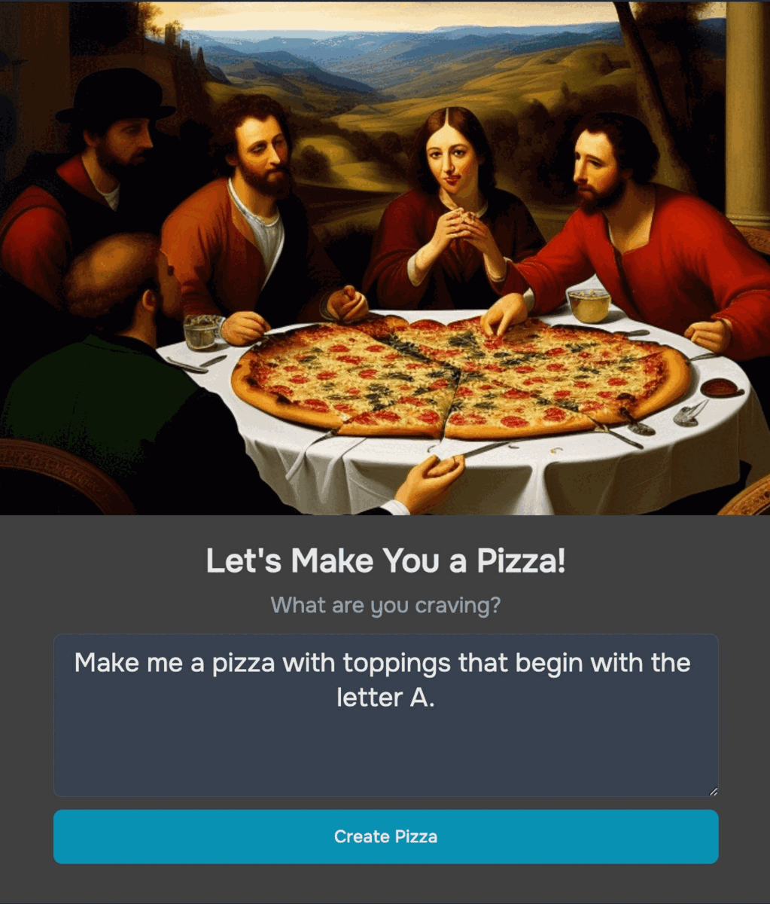

# Pizza AI

Pizza AI uses Generative AI to create the perfect Pizza. I wanted to demonstrate a business case for building apps that can combine private data with Generative AI technologies, like OpenAI and Dall-e, to create new experiences.

[Link to App](https://pizza-ai.netlify.app/)

## Getting Started

If you decide to clone this repo, make sure to host it on netlify as the app uses netlify serverless functions for API calls.
You will also need to create a Supabase account for database and storage access.

## Prerequisites

A Netlify account to host the application and manage serverless functions.
A Supabase account for database and storage solutions.
OpenAI account to access GPT and Dall-e API
SendGrid account to send emails

## Installation

### Clone the Repository

    $ git clone https://github.com/jawadshuaib/pizza-ai-frontend

### Navigate to the Project Directory

    $ cd pizza-ai

### Install the dependencies

    $ npm install

### Netlify functions

Pizza AI values security and follows best practices by utilizing Netlify's serverless functions to make API calls, thus shielding the environment variables from unauthorized access. These functions act as a secure wrapper around AWS Lambda Functions, providing a robust layer of security to all external API interactions.

To enable the React App to use netlify functions, we must run the environment using the following command using Netlify CLI:

    $ netlify dev

### Setup environment variables

Create a .env file in the root directory of the project and populate it with the necessary environment variables:

    $ OPENAI_API_KEY=your_openai_api_key
    $ SUPABASE_URL=your_supabase_url
    $ SUPABASE_KEY=your_supabase_key
    $ SENDGRID_API_KEY=your_sendgrid_api_key

Configure the Same Environment Variables in Netlify:

Navigate to your site’s settings in Netlify and add the environment variables under Site settings -> Build & deploy -> Environment.
